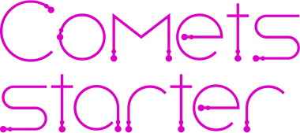

# Мини-проект «Кометы»

Небольшой пет-проект, работающий в Canvas на JavaScript.

Идея и стилевое оформление [🦊 lisinica-port.tilda.ws](http://lisinica-port.tilda.ws)

---

## Разработка

- Установка зависимостей: `npm install`
- Сборка: `npm run build`
- Запуск локального сервера: `npm start`

---

## Техническое задание

### О проекте

«Кометы» — страница с анимацией малых небесных тел, вращающихся вокруг планеты и друг друга.

### Функционал

- На странице отображается окно с просторами космоса и планетой на переднем плане.
- Размеры окна приложения подстраиваются под размер устройства пользователя.
- После загрузки необходимых ресурсов появляется логотип и кнопка "старт", после нажатия которой запускается анимация комет/астероидов, летающих по экрану и за его пределами под воздействием притяжения планеты и друг друга.
- После запуска кнопка старта сменяется на кнопку ускорения, увеличивающую скорость анимации.
